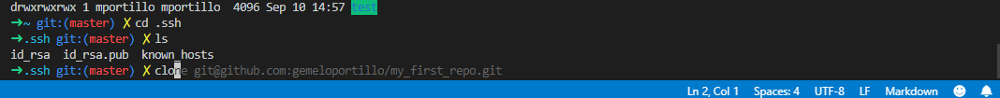

# Reto Uno. Instalar el plugin zsh-suggestions

Este plugin permite dar sugerencias de autocompletado cuando escribimos en nuestra terminal. Permite incrementar el rendimiento en el uso de la Terminal

Ejemplo de uso en nuestra carpeta:

